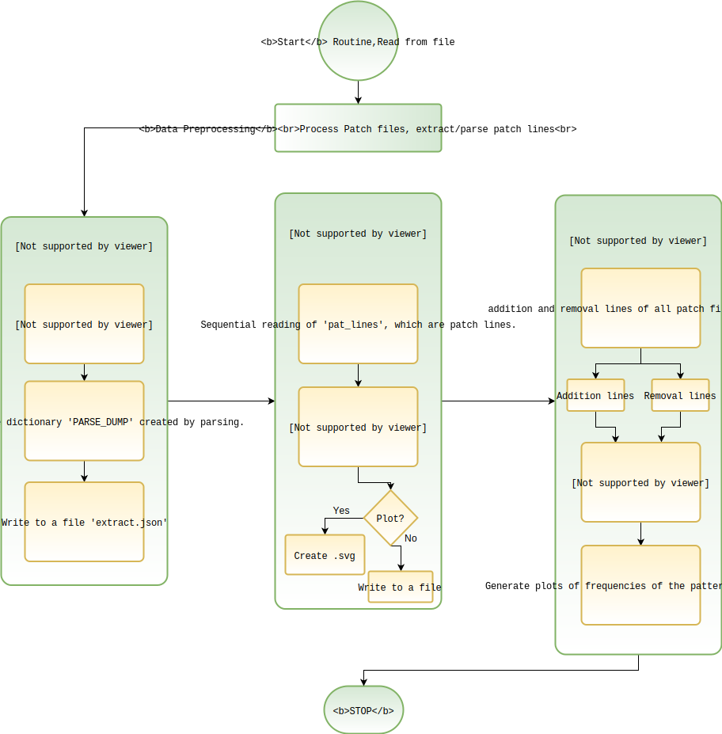

# GITalyzer

##  Summary:
GITalyzer is a git patch analyzer which does string and syntax level parsing to analyze and generate reports for the repositories written in Python. Below is the working of parser. 

To run the parsers first run:<br>
```python3 issues.py```

This will download a number of patch files from Python respositories and save them under ***Repos/repo_name/*** directory.

After the downloads are finished, run:<br>
```python3 analyzer.py```

This script will runn mutiple analysis on a syntax-level and generate reports according to the results.

The reports are *.svg* files and can be opened with a browser or any 3rd part application of your choice.

Flow Diagram:



### Dependencies:
Before running any of the above commands, run <br>
```pip3 install -r Requirements.txt```<br>

This will install the required dependencies in your machine. We recommend you use virtual environment to isolate the working env.

Create a virtual environement run: <br>
```virtualenv -p python3 <chosen_env_name_goes_here>```

*Note: This repository is a part of the CS540 Advanced Techniques in Software Engineering course imparted by Dr. Mark Grechanik at the University of Illinois at Chicago.*

### Developers:
- Debojit Kaushik
  - E-mail: dkaush4@uic.edu  
  - [Github](https://www.github.com/dkaushik94)
- Sandeep Joshi
  - E-Mail: sjoshi37@uic.edu
  - [Github](https://www.github.com/sandeepjoshi1910)